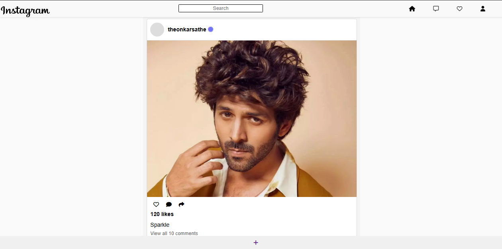
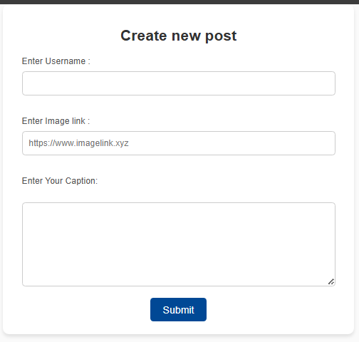

# Insta Clone

This is a basic Instagram clone built using Node.js, Express, and other web technologies.

## Features
- User can create posts with captions.
- Responsive design for mobile and desktop.
- Basic UI for creating and displaying posts.

## Screenshots

### Screenshot 1


### Screenshot 2


## Project Structure
```
├── node_modules      # Installed dependencies
├── public            # Static files like CSS, JavaScript, images
├── views             # Templates (HTML/EJS files)
├── index.js          # Entry point of the application
├── package.json      # Project metadata and dependencies
├── package-lock.json # Lock file for dependencies
└── README.md         # Documentation
```

## How to Run
1. Clone the repository:
   ```bash
   git clone https://github.com/Onkarsathe007/insta-clone.git
   ```
2. Navigate to the project directory:
   ```bash
   cd insta-clone
   ```
3. Install dependencies:
   ```bash
   npm install
   ```
4. Start the server:
   ```bash
   npm start
   ```
5. Open your browser and visit:
   ```
   http://localhost:3000
   ```

## Technologies Used
- Node.js
- Express
- HTML/CSS
- JavaScript

## Contribution
Feel free to fork the repository and make contributions. Create a pull request when ready.

## License
This project is licensed under the MIT License.
